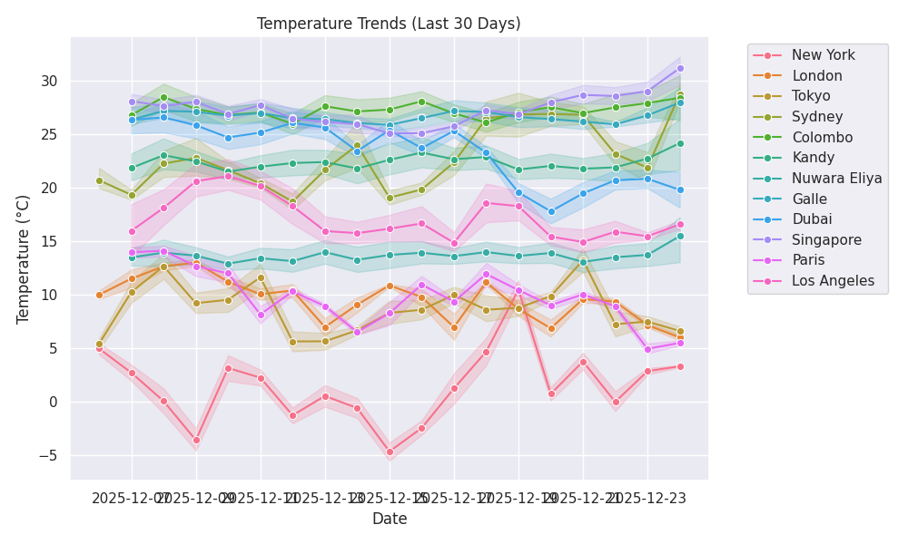

# 🌦️ Aero: Automated Weather Insight Log

> **Auto-updates every 30 minutes** with real-time data for Sri Lanka 🇱🇰 and the World 🌍.

[👉 **View Full Web Dashboard**](https://AtheequeFurkhan.github.io/Aero/)

---

## ⚡ Live Status (Updated: 2025-12-12 18:20 UTC)
            

  <h3>🏆 Weather Records (Live)</h3>
  <table>
    <tr>
        <td align="center">🔥 <b>Hottest City</b></td>
        <td align="center">❄️ <b>Coldest City</b></td>
    </tr>
    <tr>
        <td align="center"><b>Dubai</b> 25.96°C</td>
        <td align="center"><b>New York</b> 1.04°C</td>
    </tr>
  </table>

## 📊 Global Overview
| 🌍 City | 🌡️ Temp | 🌤️ Condition | 💧 Humidity | 🌬️ Wind |
|---|---|---|---|---|
| **Paris** | 9.65°C | broken clouds | 🟦🟦🟦🟦⬜ 92% | 1.54 m/s |
| **London** | 9.6°C | overcast clouds | 🟦🟦🟦🟦⬜ 86% | 4.63 m/s |
| **Sydney** | 15.71°C | few clouds | 🟦🟦🟦🟦⬜ 94% | 0.45 m/s |
| **Singapore** | 25.89°C | broken clouds | 🟦🟦🟦🟦⬜ 92% | 2.57 m/s |
| **Dubai** | 25.96°C | clear sky | 🟦🟦⬜⬜⬜ 47% | 3.09 m/s |
| **Galle** | 24.69°C | broken clouds | 🟦🟦🟦🟦⬜ 88% | 2.02 m/s |
| **Nuwara Eliya** | 10.8°C | overcast clouds | 🟦🟦🟦🟦⬜ 97% | 1.32 m/s |
| **Kandy** | 19.97°C | overcast clouds | 🟦🟦🟦🟦⬜ 98% | 1.92 m/s |
| **Colombo** | 23.91°C | overcast clouds | 🟦🟦🟦🟦⬜ 98% | 4.17 m/s |
| **New York** | 1.04°C | clear sky | 🟦🟦⬜⬜⬜ 40% | 7.2 m/s |
| **Tokyo** | 3.37°C | overcast clouds | 🟦🟦⬜⬜⬜ 49% | 0.45 m/s |
| **Los Angeles** | 21.23°C | clear sky | 🟦🟦⬜⬜⬜ 53% | 0.45 m/s |

## 📈 Temperature Trends
> Visualizing how temperature changes over the last 24 hours.

---
*Built with ❤️ by [AtheequeFurkhan](https://github.com/AtheequeFurkhan) using Python & GitHub Actions.*
