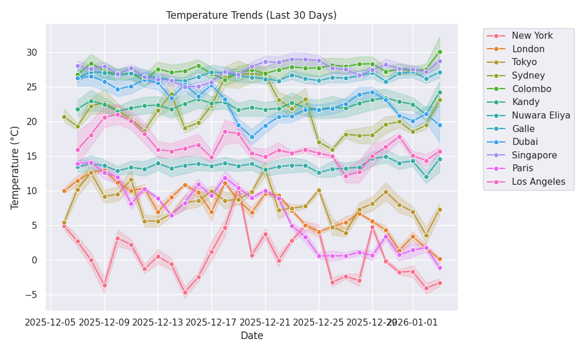

# 🌦️ Aero: Automated Weather Insight Log

> **Auto-updates every 30 minutes** with real-time data for Sri Lanka 🇱🇰 and the World 🌍.

[👉 **View Full Web Dashboard**](https://AtheequeFurkhan.github.io/Aero/)

---

## ⚡ Live Status (Updated: 2025-12-30 21:13 UTC)
            

  <h3>🏆 Weather Records (Live)</h3>
  <table>
    <tr>
        <td align="center">🔥 <b>Hottest City</b></td>
        <td align="center">❄️ <b>Coldest City</b></td>
    </tr>
    <tr>
        <td align="center"><b>Singapore</b> 26.58°C</td>
        <td align="center"><b>New York</b> 0.04°C</td>
    </tr>
  </table>

## 📊 Global Overview
| 🌍 City | 🌡️ Temp | 🌤️ Condition | 💧 Humidity | 🌬️ Wind |
|---|---|---|---|---|
| **Paris** | 2.53°C | clear sky | 🟦🟦🟦⬜⬜ 79% | 4.12 m/s |
| **London** | 2.47°C | few clouds | 🟦🟦🟦🟦⬜ 89% | 2.24 m/s |
| **Sydney** | 18.77°C | clear sky | 🟦🟦🟦⬜⬜ 69% | 0.51 m/s |
| **Singapore** | 26.58°C | broken clouds | 🟦🟦🟦🟦⬜ 82% | 3.09 m/s |
| **Dubai** | 22.96°C | clear sky | 🟦🟦⬜⬜⬜ 43% | 8.23 m/s |
| **Nuwara Eliya** | 12.74°C | overcast clouds | 🟦🟦🟦🟦⬜ 94% | 0.43 m/s |
| **Galle** | 24.46°C | broken clouds | 🟦🟦🟦🟦⬜ 91% | 2.51 m/s |
| **Kandy** | 20.34°C | broken clouds | 🟦🟦🟦🟦⬜ 97% | 0.93 m/s |
| **Colombo** | 25.02°C | broken clouds | 🟦🟦🟦🟦⬜ 88% | 5.11 m/s |
| **New York** | 0.04°C | broken clouds | 🟦🟦⬜⬜⬜ 42% | 9.39 m/s |
| **Tokyo** | 6.19°C | clear sky | 🟦🟦🟦⬜⬜ 67% | 1.54 m/s |
| **Los Angeles** | 19.52°C | overcast clouds | 🟦🟦⬜⬜⬜ 43% | 4.63 m/s |

## 📈 Temperature Trends
> Visualizing how temperature changes over the last 24 hours.

---
*Built with ❤️ by [AtheequeFurkhan](https://github.com/AtheequeFurkhan) using Python & GitHub Actions.*
